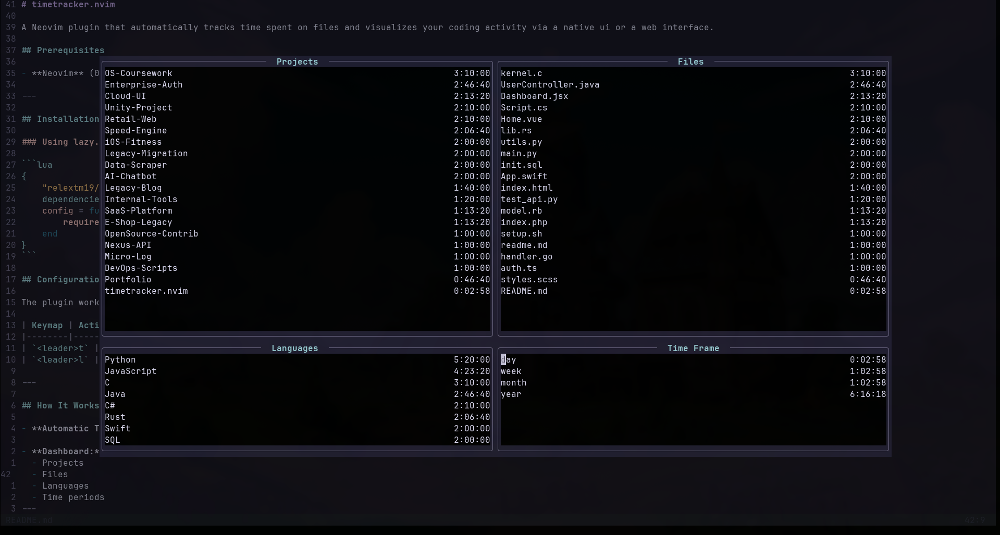

# timetracker.nvim

A Neovim plugin that automatically tracks time spent on files and visualizes your coding activity via a native ui or a web interface.


## Prerequisites

- **Neovim** (0.10+) - the editor to track activity in

---

## Installation

### Using lazy.nvim

```lua
{
    "relextm19/timetracker.nvim",
    dependencies = { "nvim-lua/plenary.nvim", "folke/snacks.nvim" },
    config = function()
        require("timetracker").setup()
    end
}
```

## Configuration

The plugin works out of the box with default settings. Keymaps:

| Keymap | Action |
|--------|--------|
| `<leader>t` | Toggle the activity dashboard |
| `<leader>l` | Toggle login/authentication |

---

## How It Works

- **Automatic Tracking:** Once the plugin is active, it automatically logs the time spent on every file you open in Neovim.

- **Dashboard:** Press `<leader>t` to view your statistics organized by:
  - Projects
  - Files
  - Languages
  - Time periods
---
